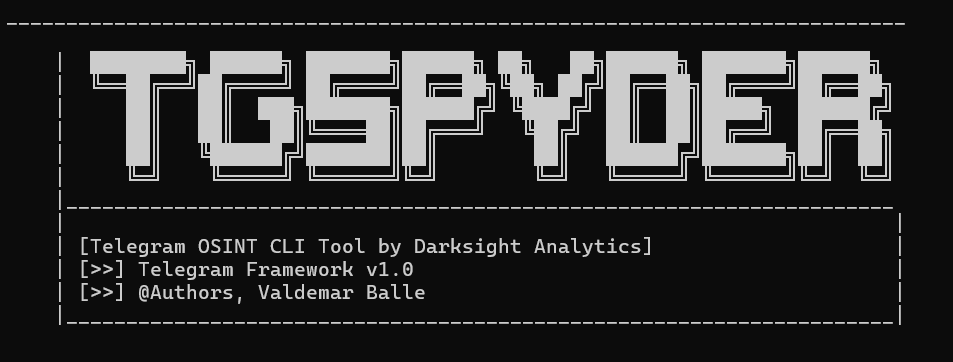
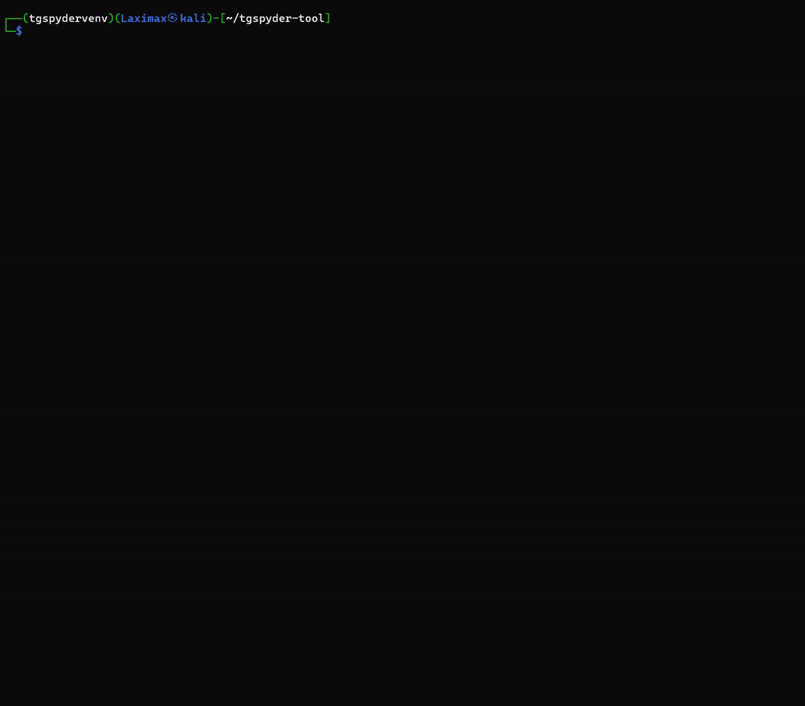

# 🕷️ TGSpyder
<p align="center">
  
</p>

TGSpyder is an Open-Source Telegram OSINT CLI Tool by **Darksight Analytics**.

## Features
- Scrape **members** list from both public and private groups to CSV
- Scrape **chat messages** from both public and private groups to CSV
- Extract **t.me invite links** from chat history (public and private groups)
- Look up a **Telegram user** by username or (limited) numeric ID
- Identify **sticker pack creator ID** (inferred via sticker set ID)
  Credits to: https://hackernoon.com/whats-wrong-with-stickers-in-telegram-deanonymize-anonymous-channels-in-two-clicks
- Proxy support:
  - Save proxy (`--set-proxy`)
  - Remove proxy (`--remove-proxy`)
  - One-off proxy override (`--proxy`)

## Requirements
- Python 3.10+

## Install
```bash
git clone https://github.com/Darksight-Analytics/tgspyder.git
cd tgspyder
pip install -r requirements.txt
pip install -e .
```
# 🕷️ Introduction

Telegram OSINT CLI Tool
Built for investigators, analysts, journalists, and researchers.

TGSpyder is a command-line OSINT tool for structured collection and analysis of Telegram data.
It enables scraping of members, messages, invite links, users, and metadata from public and private Telegram groups and channels — exporting everything into investigator-friendly CSV files.

## Features

- 📋 Scrape member lists (where Telegram allows)
- 💬 Crawl chat messages
- 🔗 Extract and de-duplicate Telegram invite links
- 🧍 Lookup users by ID or username
- 🎭 Identify sticker pack creators
- 🌐 SOCKS proxy support (Tor / VPN)
- 📁 Clean CSV output for OSINT workflows
- 📦 Output Structure

All collected data is stored in a single runtime folder:
```bash
TGSpyder Output/
├── members/
│   └── members_<target>_<timestamp>.csv
├── chats/
│   └── messages_<target>_<timestamp>.csv
└── crawled_links/
    └── crawled_links_<target>_<timestamp>.csv
```

## 🚀 Quick Start
1️⃣ Clone the repository
```bash
git clone https://github.com/Darksight-Analytics/tgspyder.git
cd tgspyder
```
2️⃣ Create & activate a virtual environment
```bash
python3 -m venv venv
source venv/bin/activate
```
3️⃣ Install dependencies
```bash
pip install -r requirements.txt
```
4️⃣ Install TGSpyder as a CLI
```bash
pip install -e .
```

Verify installation:
```bash
tgspyder --help
```
## 🔑 Telegram API Credentials
- Head over to **https://my.telegram.org** and log in with your Telegram account.  
- Navigate to **API development tools** to generate your **API ID** and **API Hash**, which are required to authenticate TGSpyder with Telegram.

## 🧭 Basic Usage
Scrape members and chats
```bash
tgspyder https://t.me/examplegroup --members --chats
```
Extract invite links only
```bash
tgspyder https://t.me/examplegroup --crawl-invites
```
User lookup
```bash
tgspyder --user 123456789
tgspyder --user @username
```
Sticker pack creator lookup
```bash
tgspyder --sticker-pack https://t.me/addstickers/packname
```

## 🌐 Proxy Support
TGSpyder supports SOCKS proxies (Tor / VPN-friendly).

## One-off proxy
```bash
tgspyder --proxy socks5://127.0.0.1:9050 <target> --chats
```
Save proxy for future runs
```bash
tgspyder --set-proxy socks5://127.0.0.1:9050
```
Remove saved proxy
```bash
tgspyder --remove-proxy
```
## 🔐 Authentication & Config
On first run, TGSpyder will prompt for:
* Telegram API ID
* Telegram API Hash
* User account or bot token

Credentials are stored locally in:
~/.tgspyder.conf

Session files are reused automatically.

## ⚠️ Limitations
* Some groups do not expose member lists
* Private groups require valid invite links
* Sticker creator attribution is not always guaranteed
* Subject to Telegram API limits

## 🧪 Ethical Use & OSINT Disclaimer

TGSpyder is intended for:
* OSINT investigations
* Academic research
* Journalism
* Threat & network analysis

Users are responsible for compliance with:
* Local laws
* Platform terms of service
* Ethical research standards

## 📄 License

MIT License
See LICENSE for details.

## 🚀 Demo

<p align="center">  </p>

## 👤 Author

- Valdemar Balle 
- Founder of Darksight Analytics

## ⚖️ Disclaimer

TGSpyder is provided for open-source intelligence (OSINT), research, investigative, and educational purposes only.

Users are solely responsible for ensuring that their use of this tool complies with:
* Applicable laws and regulations
* Platform terms of service
* Ethical research and investigative standards

The author and contributors assume no liability for misuse of this tool or for any consequences arising from its use.


